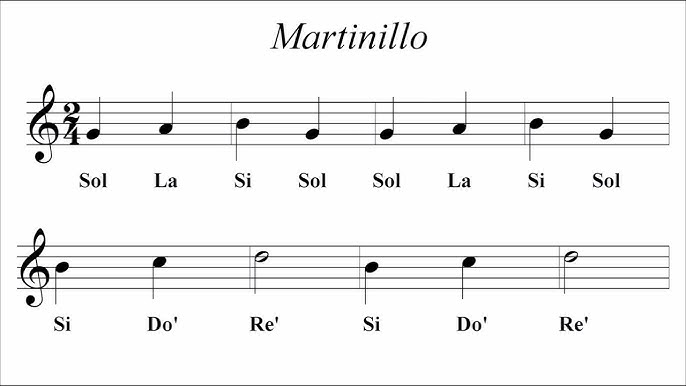
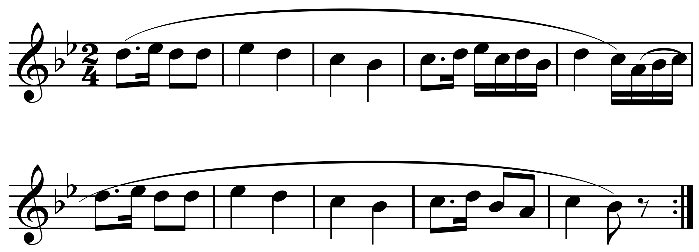

---
title: 'El título de tu artículo'
author:
  - name: Juan Pérez
    affiliation: Rancho Electrónico
    email: juanp@rancho.org
  - name: Leona Vicario
    affiliation: Movimiento Independentista
    email: leona.vicario@yahoo.mx
  - name: Fulanito
    affiliation: Universidad Nacional Autónoma de México
    email: fff@riseup.org
abstract: |
  Reemplaza este texto con un resumen de máximo 250 palabras.
  Debe estar indentado en el campo correspondiente del encabezado
  de metadatos (todo lo que esta entre `---` y `...`) en el documento markdown.
keywords:
  - Tutorial
  - Ejemplo
  - Plantilla
  - Editorial
...

# Introducción

Bienvenidx a la plantilla para autorxs de la revista Heptagrama.

**IMPORTANTE**: El uso de esta plantilla requiere un conocimiento básico del uso de la terminal de comandos de su sistema operativo.


{.class width=110px}\

El uso de esta plantilla es un requerimiento para todas las
propuestas de artículo de investigación.
Debe incluir el contenido correspondiente a cada uno de los siguientes encabezados
en el orden presentado:

1. [Introducción](#introducción)
1. [Antecedentes](#antecedentes)
1. [Objetivos](#objetivos)
1. [Hipótesis](#hipótesis)
1. [Métodos](#métodos)
1. [Resultados](#resultados)
1. [Discusión](#discusión)
1. [Conclusiones](#conclusiones)
1. [Alcances](#alcances)
1. [Declaración de conflictos de interés](#declaración-de-conflictos-de-interés)
1. [Financiamiento](#financiamiento)
1. [Agradecimientos](#agradecimientos)
1. [Contribución de co-autores](#contribución-de-co-autores)
1. [Referencias](#referencias)

Puede omitir una sección/encabezado en caso de que no aplique
a su propuesta, salvo en el caso de la introducción y las conclusiones.
Por otro lado, los encabezados de subsección que encontrará en este documento, así como de otros niveles inferiores (indicados por dos o más _hashtags_), son propios del
y deben ser excluidos de su artículo.
Es decir, su artículo no (necesariamente) incluirá una subsección titulada _Markdown_
como se encuentra en la siguiente sección.

# Antecedentes

Aquí se elabora el contexto en el cual se enmarca la investigación y desde el cuál
será leído el artículo. Responde a la pregunta _¿qué se sabe actualmente sobre este tema?_.
Su propósito es situar la investigación en un campo disciplinar, tradición de pensamiento o práctica.
Alternativamente, esta sección puede llevar el nombre de "estado del arte" o "estado de la cuestión", dependiendo del enfoque.

El contenido de esta sección puede ser incluído en la [introducción](#introducción), de manera que es posible prescindir de esta sección. Sin embargo, el contenido aquí especificado debe estar presente en alguna de la formas señaladas.

Este documento, en su calidad de tutorial, está inspirado en las plantillas utilizadas para las memorias de la _International Conference on Live Coding_ [@ICLCtemplates]
y en el trabajo editorial de perrotuerto [@perrotuertoBlog], que utiliza exclusivamente herramientas de software libre y abierto.^[TODO: Decidir si las ligas van dentro de las referencias.]

## Markdown

Markdown es un lenguaje de marcado, en el mismo sentido que lo es HTML: los elementos de su sintaxis nos permiten *indicar el rol de cada objeto* dentro del texto final.
Sin embargo, a diferencia de este último, Markdown está diseñado para que el texto plano siga siendo legible.
Corresponde al paradigma WYSIWIM (_What You See Is What I Mean_), en el que se
indica de manera declarativa el formato de cada objeto del texto, separando de manera
efectiva el contenido de su formato de impresión (tipografía, distribución, etc.).

En sí mismo este documento ejemplifica varias de las anotaciones de formato disponibles en ***Markdown***.
Para ver como se traduce Markdown al formato de publicación, necesitará comparar el archivo fuente `src/manual_de_autores.md` con `manual_de_editores.pdf`.
También puede consultar la
[referencia de Pandoc Markdown](https://pandoc.org/MANUAL.html#pandocs-markdown)
para conocer la sintaxis de formatos más avanzados o esta hoja de
[referencia rápida](https://www.markdownguide.org/cheat-sheet/) para los básicos.

Las siguientes son las razones por las que hemos incluido el formato Markdown
como requerimiento para las propuestas de artículo:

1. Elaborar el artículo en Markdown permite alx autorx enfocarse en el contenido del mismo,
dejando a discreción del equipo editorial el formato y diseño del cuerpo del texto y bibliografía.
1. Al separar el contenido de la forma, nuestro equipo editorial tiene la facilidad de
adaptar y reconfigurar el formato de salida de los textos a conveniencia,
sea para impresión (PDF) o web (HTML) por ejemplo, a partir de un mismo archivo fuente.
1. Markdown tiene un valor independiente de la aplicación a la revista;
se trata de una tecnología ubicua en una gran variedad de contextos
(plataformas de código, diseño web, aplicaciones de notas inteligentes)
que otorga facilidades accesibles para hacer publicaciones profesionales.

Sugerimos crear una copia de este documento, o mejor de todo el repositorio que lo contiene, como punto de partida para sus artículos.
Para ello lo más conveniente es clonarlo utilizando el siguiente comando.

`git clone https://github.com/ninioArtillero/heptagrama-maqueta.git`

Con gusto podemos responder cualquier pregunta sobre Markdown y esta plantilla en relación a
una propuesta de artículo vía [revistaheptagrama@gmail.com](mailto:revistaheptagrama@gmail.com).

### Producir un PDF

Exportar su artículo a PDF le permitirá verlo de manera similar a como será publicado.

Para producir un PDF a partir del documento fuente en Markdown podemos ejecutar en una terminal
el siguiente comando:

 ```{.bash}
pandoc --template=pandoc/heptagrama.latex \
--citeproc --number-sections manual_de_editores.md \
-o manual_de_editores.pdf
 ```

Este comando presupone que la sesión de terminal apunta al directorio del repositorio,
por lo que usamos ubicaciones relativas.
En general la opción `--template` debe apuntar a la ubicación del archivo `heptagrama.latex` y `manual_de_editores.md` a la ubicación del archivo fuente.

 Para un documento de mayor calidad añadimos la opción `--pdf-engine=xelatex` al comando anterior.

### Dependencias

Para que el comando anterior funcione es necesario instalar:

* Pandoc. [Instrucciones oficiales de instalación](http://pandoc.org/installing.html).
  * MacOS: Se recomienda utilizar el administrador de paquetes [Homebrew](http://brew.sh/). Correr
    `brew update` en la terminal y en seguida `brew install pandoc`.
  * Windows: Se recomienda utilizar el administrador de paquetes [Chocolatey](https://chocolatey.org/). Correr en terminal `choco install pandoc`.
  * Linux: usar el administrador de paquetes de la distribución.
* LaTex (se puede instalar de manera similar utilizando los administradores de paquetes antes mencionados). **No tendra que manipular ningún archivo LaTex, Pandoc lo utiliza internamente para procesar los documentos**. Se recomienda las siguientes distribuciones:
[MacTeX](https://www.tug.org/mactex/) para MacOS,
[MiKTeX](https://miktex.org/) o [Tex Live](https://www.tug.org/texlive/) para Windows y
[Tex Live](https://www.tug.org/texlive/) para linux.
  * Asegurarse de tener instalado XeTeX en caso de tener una instalación parcial de la distribución de LaTeX (particularmente en el caso de Tex Live en Linux).
* Fuentes:
  * [Linux Libertine](http://www.linuxlibertine.org/index.php?id=91&L=1)
  * [Inconsolata](http://levien.com/type/myfonts/inconsolata.html)

Si además se instala `make`,[^1] entonces puede ejecutar `make pdf` o `make html`
desde la ubicaciónd el repositorio para generar el pdf (en lugar de los comandos de Pandoc, definidos dentro el archivo `Makefile`).

[^1]: [https://www.gnu.org/software/make/](https://www.gnu.org/software/make/)

# Objetivos

En los objetivos se responde a la pregunta _¿qué persigue esta investigación?_

Si no se ha planteado en la secciones anteriores, este es un espacio idóneo para plantear la pregunta de investigación.

El objetivo del presente documento es doble:

1. Servir de plantilla para que los autores elaboren sus propuestas de artículo.
1. Ser una referencia de Markdown autocontenida y suficiente para los propósitos de un artículo de investigación en música.

Estos objetivos se suman a la meta en Heptagrama de tener un sistema de maquetado y publicación semiautomatizado.
Al ser un proyecto sostenido por el trabajo voluntario de alumnxs y exalumnxs del posgrado, 
requiere de estrategias que aprovechen al máximo los recursos humanos.
Además resulta imperativo que sean accesibles, gratuitas y fáciles de retomar para que nuevos miembros del comité editorial
puedan dar continuidad al trabajo realizado.

# Hipótesis

Aquí se hace explícitas las suposiciones que la investigación pone a prueba.
Las investigaciones en humanidades puede no haber una hipótesis explícita.

# Métodos

Esta sección es imprescindible. Aquí se abordan dos preguntas _¿cómo se responde a la pregunta de investigación?_ y
_¿cómo se analizan los datos?_.
En suma, los métodos utilizados esclarecen al lector los medios necesarios para reproducir un experimento
o entender cómo llegar a los resultados de la investigación presentada.

El primer objetivo planteado se alcanza necesariamente en un tiempo posterior a la publicación de este documento,
razón por la que excede sus límites. Una vez que un autor motivado lleva a cabo la composición exitosa de su artículo de investigación
se podrá considerar el objetivo alcanzado.

Una observación clave es que este primer objetivo depende en gran medida del segundo.
En las siguientes secciones se ejemplifican diversas categorías de
formato y su sintaxis asociada en Markdown. 
Estas incluyen la estructura del texto en secciones y subsección (es decir, el manejo de títulos),
énfasis del texto (negritas y cursivas), el uso de citas bibliográficas, añadir imágenes y enlaces, incluir código fuente (texto en fuente monoespacio con resaltado de sintaxis),
añadir ejemplos musicales y ecuaciones matemáticas.


## Estructura del texto

Los títulos de sección y subsección, así como cualquier jerarquía de títulos,
se marca utilizando numerales/sostenidos (`#`, `##`, `###`, ...) al principio de la línea correspondiente. Estos títulos deben estar en su propio párrafo.

Como se observa aquí,
los saltos de línea
se interpretan como
espacios.

Los párrafos y los títulos deben estar aislados por líneas vacías; múltiples líneas vacías se interpretan como una sola como se observa al final de esta sección (más lineas vacías no aumentan el espacio entre párrafos o títulos).

Para crear notas al pie de página se ubica su contenido en otro párrafo etiquetado con una palabra de referencia o identificador.[^identificador] También se puede incluir la nota en la
misma línea sin necesidad de identificador .^[En este caso, la nota al pie de página está indicado en la misma ubicación que la refiere. De esta forma no requiere un identificador, pero no puede tener múltiples párrafos.]

[^identificador]: Esta es una nota al pie de página.

    La primera línea de los párrafos subsecuentes están indentados
    para indicar que pertenecen a la misma nota.

    La llave `identificador` utilizada para esta nota es una palabra arbitraria que permite identificar el pie de página; equivalentemente podemos usar un número.
    Al renderizar cada pie estará indicado por un número correspondiente a su ubicación en la secuencia de notas.


## Énfasis

Así mismo podemos hacer de un texto **negrita**, _cursiva_, o **_ambas_** para
dar énfasis a oraciones o palabras. _No debe haber espacio entre las marcas y el principio y final de la palabra u oración_.

## Citas

Se puede incluir [bibliografía añadiendo elementos en formato _biblatex_](https://www.overleaf.com/learn/latex/Bibliography_management_with_biblatex#The_bibliography_file) al archivo `referencias.bib`. Estas pueden ser generadas de manera automática por software de gestión bibliográfica como [Zotero](https://www.zotero.org/); también es posible hacerlo a mano o utilizando algunas herramientas en línea.
Con los siguientes pasos se añade una referencia para ser citada en el texto:[^citas]

1. Añadir la entrada correspondiente en formato _Biblatex_, a `references.bib`. Ejemplo:

    ```
    @book{Blackwell2022Live,
        title = {Live Coding: A User's Manual},
        shorttitle = {...},
        author = {...},
        date = {...},
        series = {...},
        publisher = {{...}},
        location = {{...}},
        url = {...},
        abstract = {...},
        isbn = {...},
        pagetotal = {...},
        keywords = {...}
    }
    ```

2. Utilizar la llave de referencia indicada al principio de la entrada.
   En el ejemplo es `Blackwell2022Live`.
3. Llamarla dentro del texto dependiendo del caso
   1. `@Blackwell2022Live` sale como `Blackwell et al. (2022)`.
   2. `[@Blackwell2022Live]` sale como `(Blackwell et al. 2022)`.
   3. `[@Blackwell2022Live; @Magnusson2018Performing]` sale como `(Blackwell et al.
2022; Magnusson and McLean 2018)`.

[^citas]: [Sintaxis de citas en el manual de Pandoc](https://pandoc.org/MANUAL.html#citation-syntax).

Por ejemplo, Blackwell et al. describen la recursión temporal como una estrategia para codificar el cambio de una estructura musical en el tiempo:

> The 2011 Extempore system and its 2005 precursor Impromptu, both by Andrew Sorensen, are similar in that music is declaratively represented, using step-by-step structures associated with imperative programming.
> A core feature of Extempore is temporal recursion, in which a function calls itself with a particular time delay.
> This uses what is known as tail recursion, in which the final step in a function is the recursive call to itself.
> Temporal recursion is Extempore’s solution to a problem that every live coding environment has to face: How can a program be interpreted while it is itself undergoing change? A temporally recursive function always runs to the end, but if it is replaced in the meantime, it then recursively calls this new version of itself.
> Temporal recursion therefore manages both change and time. [-@Blackwell2022Live, chap. 6].

Esta y otras aproximaciones teóricas a la música están mediadas por un contexto que el investigador en música valida o cuestiona:

> La existencia de un marco teórico no es una exclusiva de los textos científicos.
> El marco teórico existe siempre, seamos o no conscientes de ello. Hablar de «período clásico» en relación con las obras de Haydn y Mozart o argumentar en torno a la fascinación de Bartók por la «música popular» por ejemplo, supone hacer nuestra una terminología cuyo origen posiblemente desconocemos y que puede ser objeto de fuertes discrepancias.
> Incluso el más humilde de los textos de divulgación contribuye a consolidar antiguas certezas, si las asume como propias.
> Por el contrario, si al escribir tomamos una posición a contracorriente, aunque avalada por la opinión de otros investigadores de prestigio, sin duda estaremos contribuyendo a difundir nuevos planteamientos que, al menos hoy, nos parecen más adecuados.
[@Chiantore2016Escribir, p. 24]

En `references.bib` podemos ver ejemplos de artículo de revista [@Toussaint2005Euclidean], de
artículo de memorias de coloquio [@Melkonian2019What], libros [@Blackwell2022Live;@Chiantore2016Escribir] y capítulo de libro [@Magnusson2018Performing]. Existen más categorías cuya elección dependerá del material referenciado. Las referencias correspondientes a las citas llamadas en el texto serán desplegadas automáticamente al final del artículo, después del título vacío [Referencias](#referencias).

## Imágenes y enlaces {#imágenes}

Podemos incluir enlaces internos y externos en el texto. Por ejemplo, enlazar a la sección sobre [Markdown](#markdown) o una página de internet, como este [manual de Markdown en español](https://markdown.es/sintaxis-markdown/). Para incluir el enlace explícitamente, utilizamos la misma sintaxis, repitiendo la dirección: [https://sites.google.com/view/heptagrama-unam/](https://sites.google.com/view/heptagrama-unam/).

La sintaxis para incluir imágenes es similar: basta con agregar ! al inicio del enlace. Por ejemplo, si ubicamos las imágenes en `/src/img/`, y queremos incluir la imagen de nombre `imagen.jpg` la incluimos así:

``.

Si la llamada a la imagen es lo único en su párrafo, entonces se incluirá como figura y se acomodará en el texto de manera automática. En este caso el texto de la liga se muestra como la descripción de la figura. También podemos referir a una figura utilizado su etiqueta, por ejemplo la [Figura 1](#martinillo).

{#martinillo}


De otra forma dicho texto queda como texto alternativo de la imagen (que, en el caso de HTML, significa que sólo se muestra cuando la página web no logra cargarla). Por ejemplo, una imagen en linea con atributos (modificando su tamaño): {#id .class width=30 height=20px}.

## Bloques de Código

Podemos hacer que el texto adquiera fuente monoespacio (o de [código](#mycode)) utilizando el símbolo \` como `delimitador`.

    Logramos lo mismo para un párrafo indentándolo
    cuatro espacios o un TAB

Una opción más flexible es insertar tres o más \` para producir un bloque de código en el que podemos indicar el lenguaje de programación para el marcado automático de su sintaxis:

```haskell
factorial :: Int -> Int
factorial 0 = 1
factorial n = n * factorial (n - 1)
```

Equivalentemente podemos delimitarlo utilizando tildes `~`, e incluir atributos para el formato del mismo (aunque no todos estos atributos aplican para algunos los formatos de salida). Se necesitan mínimo 3 tildes en la línea de apertura y más o igual en la línea de cierre:

~~~~ haskell {#mycode .numberLines startFrom="100"}
quickSort :: Ord a => [a] -> [a]
quickSort []     = []
quickSort (x:xs) = quickSort (filter (< x) xs)
                   ++ [x] ++
                   quickSort (filter (>= x) xs)
~~~~~~~~~~~~~~~~~~~~~~~~~~~~~~~~~~~~~~~~~~~~~~~~~

Para más referencia consultar la sección [Verbatim (code) blocks](https://pandoc.org/MANUAL.html#verbatim-code-blocks) del manual de Pandoc.

## Música

Para incluir música en pentagrama podemos generarla desde una aplicación externa e insertarla como imagen en la forma que vimos [antes](#imágenes). Como ejemplo tenemos este fragmento de la Feldpartita de Haydn en si♭:

\


Como alternativa al uso de imágenes para incluir música en pentagrama, se puede utilizar la [notación abc](https://abcnotation.com/) en un bloque de código. Tras bambalinas este código es utilizado para generar la imagen en cuestión. Para ello es necesario tener instalado [absm2ps](https://abcnotation.com/software#abcm2ps).

```abc
X:1
T:Speed the Plough
M:4/4
C:Trad.
K:G
|:GABc dedB|dedB dedB|c2ec B2dB|c2A2 A2BA|
  GABc dedB|dedB dedB|c2ec B2dB|A2F2 G4:|
|:g2gf gdBd|g2f2 e2d2|c2ec B2dB|c2A2 A2df|
  g2gf g2Bd|g2f2 e2d2|c2ec B2dB|A2F2 G4:|
```

## Matemáticas

Se pueden incluir fórmulas matemáticas en linea, $\sqrt{3x-1}+(1+x)^2$, o en su propio párrafo
$$\int_{a}^{b} x^2 \,dx$$
$$\left( \sum_{k=1}^n a_k b_k \right)^2 \leq \left( \sum_{k=1}^n a_k^2 \right) \left( \sum_{k=1}^n b_k^2 \right)$$
utilizando el delimitador `$` y la notación de LaTex.

# Resultados

_¿Qué saberes obras o productos de valor estético o académico son fruto del proceso de investigación?_

# Discusión

Aquí se interpretan y contrastan los resultados con otras evidencias, con otras obras o reflexiones estéticas, incluidas las limitaciones propias del trabajo realizado.

# Conclusiones

_¿Qué podemos concluir respecto después de leer el artículo?_ 

_¿Cuáles son los casos de uso?_

_¿Qué se lleva el lector?_

# Alcances

Aquí se pueden extender las conclusiones para discutir vertientes de trabajo futuro.

__¿Qué implicaciones puede tener para otros campos, disciplinas o prácticas?_

## Despedida

Esperamos recibir sus propuestas terminadas en [revistaheptagrama@gmail.com](mailto:revistaheptagrama@gmail.com). Notificaremos de las diversas etapas de revisión y tiempos de respuesta.

En Heptagrama la revisión por pares es doble ciego siguiendo los lineamientos de publicación [_Open Access_](https://www.openaccess.nl/en/what-is-open-access) {.class height=10px}. Para más información consultar nuestras [políticas editoriales](https://sites.google.com/view/heptagrama-unam/informaci%C3%B3n-para-publicar/pol%C3%ADticas-editoriales).

Las siguientes secciones son protocolarias.

# Declaración de conflictos de interés

Aquí se mencionan los nombres de aquellas personas con una relación laboral o personal con el autor (incluido el autor mismo), en el caso de que estuvieran involucradas en el proceso editorial o de arbitraje de la revista Heptagrama.

# Financiamiento

Quién financia el trabajo presentado.

# Agradecimientos

Agradecimientos a familiares, amigxs, colegas y colaboradorxs. Esta sección es opcional.

# Contribución de co-autores

Mencionar los aportes realizados por cada uno de los autores mencionados en la
entrada de metadatos en el encabezado del documento.

El primer nombre corresponde a la autora que escribió y llevó a cabo la investigación, es decir la autora propiamente. 
El resto de autores son considerados co-autores, y convencionalmente el último nombre es el del tutor o mentor que guió la investigación.

# Referencias

**IMPORTANTE**: Esta sección del documento debe quedar vacía ya que es generada de manera automática
a partir del documento bibliográfico que debe acompañar a la propuesta.
